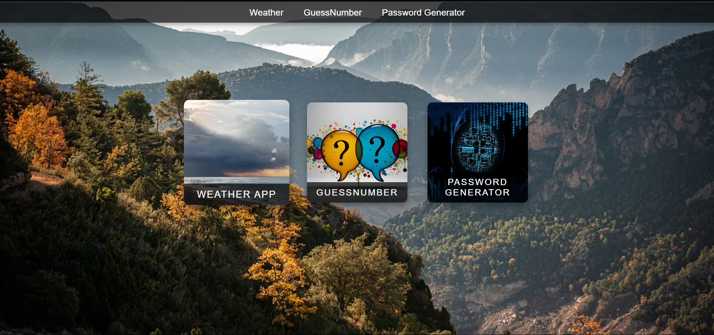
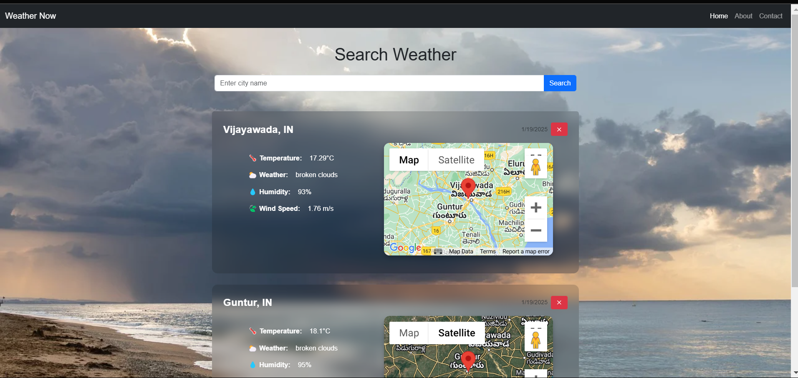

# Integrated Projects Repository

## Overview
This repository contains three integrated projects built using HTML, CSS, and JavaScript. It utilizes LocalStorage, the Weather API, and the Map API to deliver functional and interactive applications.

### Projects:
1. **Weather App**
   - Displays weather details fetched from a Weather API.
   - Shows the location of the entered city using a Map API.
   - Maintains a history of searched cities using LocalStorage.

2. **Number Guessing Game**
   - A game where the user has 10 chances to guess a number between 1 and 100.
   - Provides feedback after each guess.

3. **Password Generator**
   - Generates secure passwords based on user preferences.

---
## Homepage
The homepage serves as a gateway to all three projects. Clicking on a project will redirect the user to its respective page.



 ---


## Features
### Weather App


### Number Guessing Game


### Password Generator


---

## Technologies Used
- **Frontend**: HTML, CSS, JavaScript
- **APIs**: Weather API, Map API
- **Storage**: LocalStorage

---

## How to Run
1. Clone the repository:
   ```bash
   git clone https://github.com/MdSajida/Web_project.git
   ```
2. Navigate to the project folder:
   ```bash
   cd Web_project
   ```
3. Open `project.html` in your browser to explore the integrated projects.

4. Make sure to replace placeholders with your API keys:
- In  weather folder ,In `index.html`:
  ```html
  <script async
      src="https://maps.googleapis.com/maps/api/js?key=YourGoogleMapApiKey&loading=async">
  </script>
  ```
- In  weather folder,In `script.js`:
  ```javascript
  const weatherApiKey = "YourWeatherApiKey";

---

## Contributing
Feel free to fork this repository and make improvements. Contributions are welcome!


